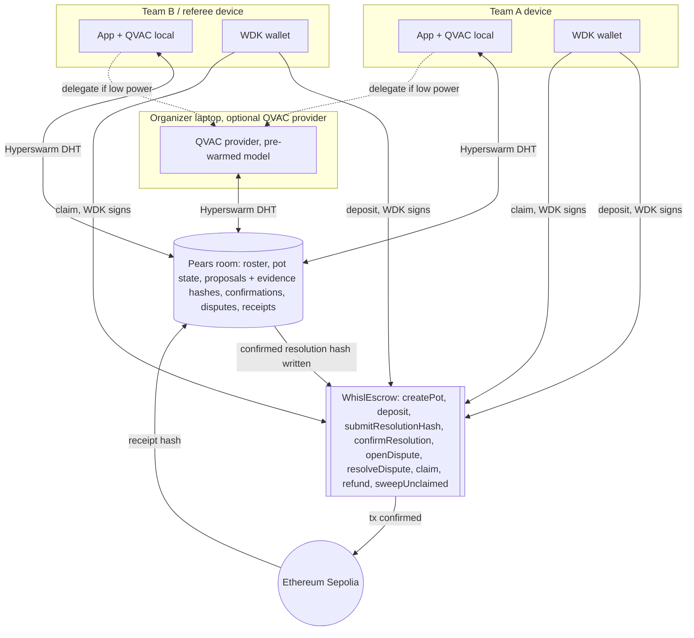
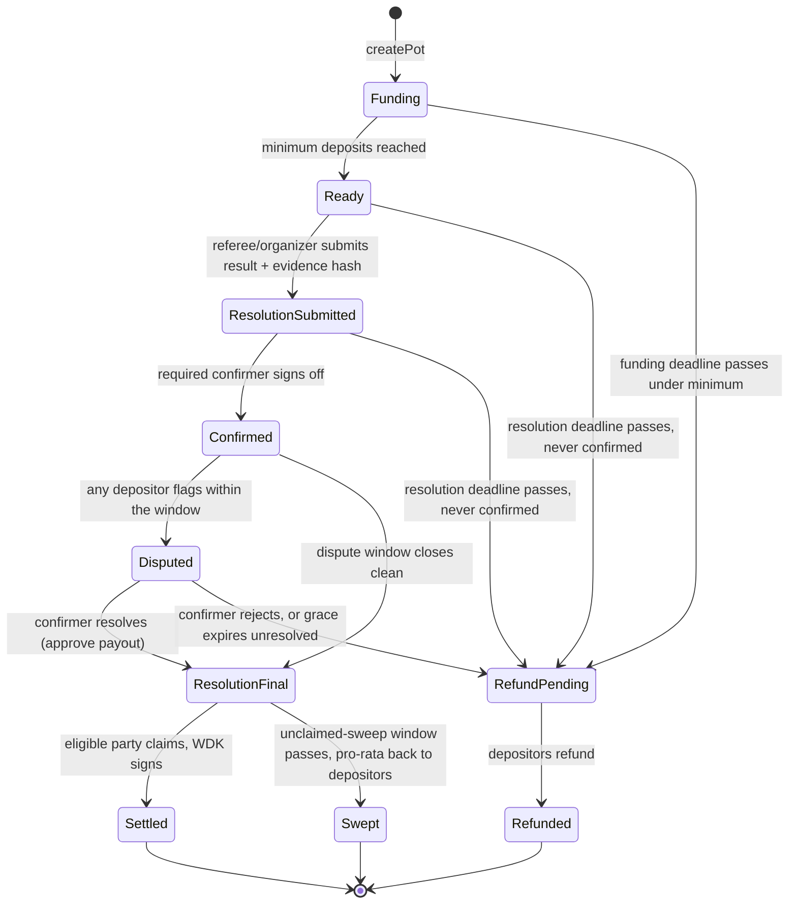

# Whisl architecture

Whisl is a P2P football settlement room. Match events are captured locally, confirmed by the room,
synced peer-to-peer, and paid out through self-custodial USD₮ wallets. **GoalDrop** is the flow
inside it: capture a match event → local QVAC parse → room confirmation → WDK payout.

**Locked mechanic — shared pledge, not backed outcome.** N depositors fund one pot under one
trigger condition. Payout goes to a fixed recipient or splits pro-rata among depositors. Nobody's
stake pays for someone else being wrong. That is why *pot, pledge, reward, referee-confirmed
payout* are honest words here — not a rebrand of betting. There are no opposing sides, ever.

> Build note: this build settles on **Ethereum Sepolia** (chainId 11155111) — Tether's docs
> describe no Plasma testnet, and the Plasma endpoint is a live/production chain. The escrow takes
> the token per-pot, so the target chain is a deployment detail, not a code change.

## System

## Pot state model

The escrow enforces every timing gate on-chain against `block.timestamp`; the room mirrors these
deadlines for display. Off-chain capture states (Capturing/ParsingLocal/…) live in the Pears room.

**Known tradeoffs (by design):**
- Dispute windows run on the room's wall-clock, not gated on every peer being online — an offline
  peer can miss their chance to flag a specific result. Correct for a no-central-server system;
  belongs in onboarding copy.
- `ResolutionFinal` can sit unclaimed (pull-based). `sweepUnclaimed` returns it pro-rata after the
  window. `sweepUnclaimed` loops depositors, so it assumes watch-party-scale N (see build log).
- A pot that reaches `Ready`/`ResolutionSubmitted` but is never confirmed by its `resolutionDeadline`
  refunds depositors — no funds are locked waiting on a confirmation that never comes.

## Components

- **Escrow** — [`contracts/src/WhislEscrow.sol`](../contracts/src/WhislEscrow.sol). Deployed to
  Sepolia; see [`deployments.json`](../deployments.json).
- **Pears room** — [`room/src/room.js`](../room/src/room.js) (Autobase + Hyperbee view enforcing the
  conflict rules), [`room/src/swarm.js`](../room/src/swarm.js) (Hyperswarm transport).
- **WDK + GoalDrop** — [`app/src/wdk.js`](../app/src/wdk.js) (wallet + approve/deposit),
  [`app/src/goaldrop.js`](../app/src/goaldrop.js) (submit/confirm/dispute/resolve/claim, on-chain +
  room mirror).
- **QVAC** — [`app/src/qvac.js`](../app/src/qvac.js) (Qwen3-VL-2B capture + manual fallback),
  [`app/src/delegated.js`](../app/src/delegated.js) (provider/consumer delegation).
- **Tournament** — [`app/src/tournament.js`](../app/src/tournament.js) (cup/fixtures/standings
  wrapping the pot mechanic).
